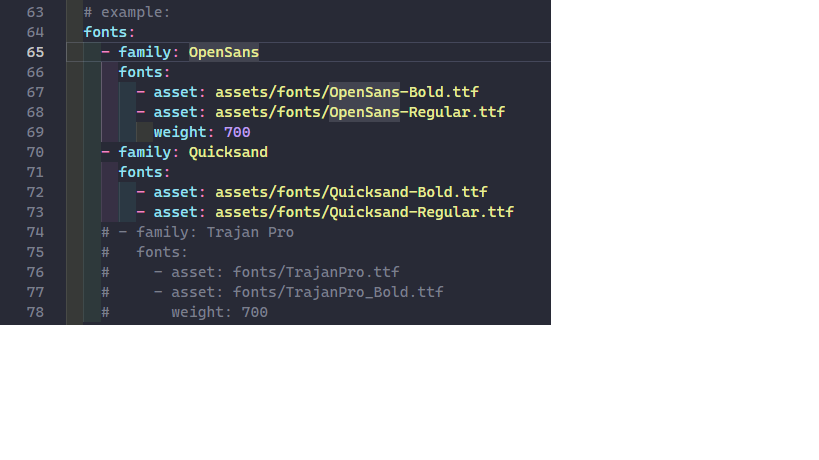

# 0. Self-learning Flutter 
The Course I took part in Udemy about flutter frawework.

# 3. Widgets, Styling, Adding Logic - Personal Expense Application
This Section is more deeper into Flutter Basics, most of the sections is about Basic Widgets and Styling
## 3.1 Widget
## 3.2 Styling
### 3.2.1 Custom Fonts and Working with Text Themes
- Setting fonts in pubspec.yaml
- Setting theme: ThemeData(fontFamily: ) in MaterialApp() for the whole application
- Setting theme: for each small components in the application
#### 3.2.1.1 Setting fonts in pubspec.yaml

## 3.3 Adding Logic
