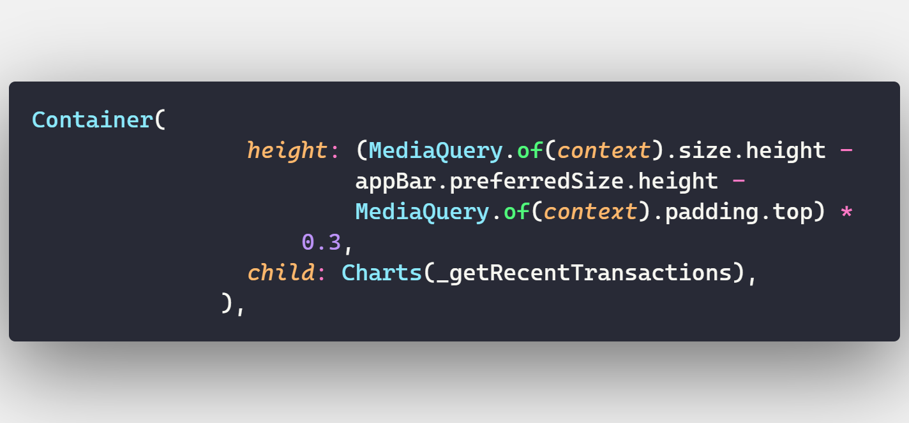
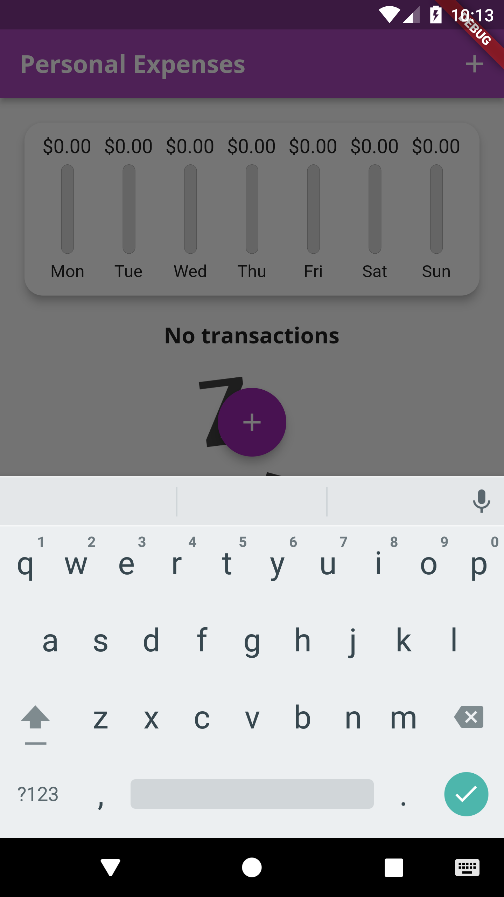

# 0. Self-learning Flutter

The Course I took part in Udemy about flutter frawework.

# 3. Widgets, Styling, Adding Logic - Personal Expense Application

This Section is more deeper into Flutter Basics, most of the sections is about Basic Widgets and Styling

## 3.1 Widget

## 3.2 Styling

### 3.2.1 Custom Fonts and Working with Text Themes

- Setting fonts in pubspec.yaml
- Setting theme: ThemeData(fontFamily: ) in MaterialApp() for the whole application
- Setting theme: for each small components in the application

#### 3.2.1.1 Setting fonts in pubspec.yaml

#### 3.2.1.2 Setting theme: ThemeData(fontFamily: ) in MaterialApp() for the whole application

There is some update for the Flutter 2.5.0 version:

- display4 => headline1;
- display3 => headline2;
- display2 => headline3;
- display1 => headline4;
- headline => headline5;
- title    => headline6;
- subhead  => subtitle1;
- subtitle => subtitle2;
- body2    => bodyText1;
- body     => bodyText2;

## 3.3 Beside Knownledge

### Date-Time format in flutter

**Library:** import 'package:intl/date_symbol_data_local.dart';

- **DateFormat.yMMMd().format(DateTime.now());** With:

  - **DateFormat.yMMMd()**: is an name consturctor of Time Format class
  - **DateTime.now()**: get the locally time from computer
Using themeData: argument for theme ajustment, appBarTheme: for the appBar, textTheme for the rest of the App
- **In ThemeData**:
  - **PrimarySwatch**: will get different shades which is used by some Flutter widgets automatically.
  - textTheme: ThemeData.light().textTheme.copyWith() is the setting for the theme of whole application, inside copyWith, we have many parameter for each kind of title we want to use, from the **headline6 to headline**
  - Easily we can edit the properties of the title by using **TextStyle()**, with many named parameters inside like: **fontFamily, fontWeight, fontSize..**

## 3.4 Adding Logic

## 3.5 Adding Picture to Application

- Need an image (from any source)

- Copy image into the images folder in project

- In the dart file, using Image.asset('link to the image')

# 4 Some Responsive and adaptive for User Interface

Some adjustments that a beginner should use to enhance UI for each specific device orientation

## 4.1  Dynamically calculating the height size of each Widget in Flutter

We can use the MediaQuery.of(context).size.height * percentage of the current wrapper widget to calculate the height for each widgets. For an example here:

- The height for **ChartBar Widget** takes 40% of the screen
- The **Transactions' List** widget take 60% of the height for whole the screen
- Remember to minus the **appBar** with **statusBar**

Tips:

- Make a variable of **AppBar** type and Store the AppBar Widget
- We can also do the same way with all the widgets which are duplicate

Explanation:

- **appBar.preferredSize.height** is the height for AppBar
- **MediaQuery.of(context).padding.top** is the padding field that is used to display the status bar on the top of the AppBar

We also need to be aware of DRY (**Dont't Repeat Yourself**) because of improving the performence of the application by not creating again and again the same Object

- Solution: we can make a new variable with the syntax: **final variable_name** and assign it with the widget

## 4.2 Some changes in different Orientations

We can check the orientarion of the device by using **Orientation.lanscape** or **Orientation.portrait** which are respective for lanscacpe and portrait screen orientation.

- Make a variable: **bool isLanscape = MediaQuery.of(context).orientation == Orientation.lanscape**

- This will check the orientaion. if the **isLanscape == true** mean that the orientation of the device is now lanscape, else it is now portrait.
- An entire code in the **home_page.dart**

## 4.3 Keyboard hides your ShowModalBottomSheet

If a keyboard hides your ShowModalBottomSheet, you can use **SingleChildScrollView** and manually adjust the padding for each Edge of Card widget covered by ShowModalBottomSheet widget by:

- When your keyboard hides ShowModalBottomSheet widget:

- Applying the method above:
