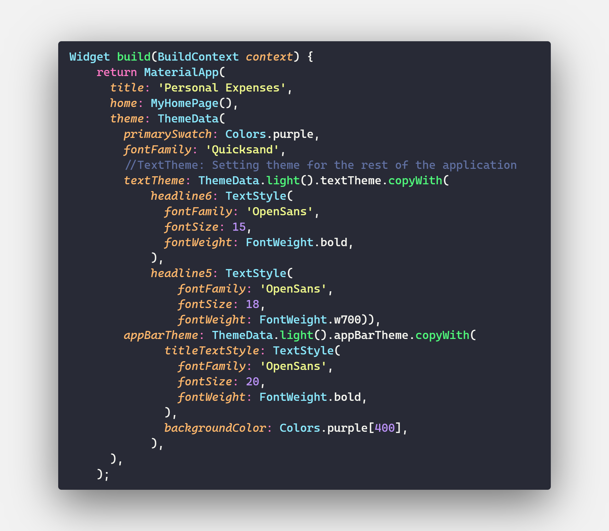

# 0. Self-learning Flutter

The Course I took part in Udemy about flutter frawework.

# 3. Widgets, Styling, Adding Logic - Personal Expense Application

This Section is more deeper into Flutter Basics, most of the sections is about Basic Widgets and Styling

## 3.1 Widget

## 3.2 Styling

### 3.2.1 Custom Fonts and Working with Text Themes

- Setting fonts in pubspec.yaml
- Setting theme: ThemeData(fontFamily: ) in MaterialApp() for the whole application
- Setting theme: for each small components in the application

#### 3.2.1.1 Setting fonts in pubspec.yaml

#### 3.2.1.2 Setting theme: ThemeData(fontFamily: ) in MaterialApp() for the whole application

There is some update for the Flutter 2.5 version:

- display4 => headline1;
- display3 => headline2;
- display2 => headline3;
- display1 => headline4;
- headline => headline5;
- title    => headline6;
- subhead  => subtitle1;
- subtitle => subtitle2;
- body2    => bodyText1;
- body     => bodyText2;

## 3.3 Beside Knownledge

### Date-Time format in flutter

Libraby: import 'package:intl/date_symbol_data_local.dart';

- DateFormat.yMMMd().format(DateTime.now()); With:

- DateFormat.yMMMd(): is an name consturctor of Time Format class
- DateTime.now(): get the locally time from computer
Using themeData: argument for theme ajustment, appBarTheme: for the appBar, textTheme for the rest of the App
In ThemeData:
- PrimarySwatch: will get different shades which some Flutter widgets automatically use.

## 3.4 Adding Logic

## 3.5 Adding Picture to Application

- Need an image (from any source)

- Copy image into the images folder in project

- In the dart file, using Image.asset('link to the image')

